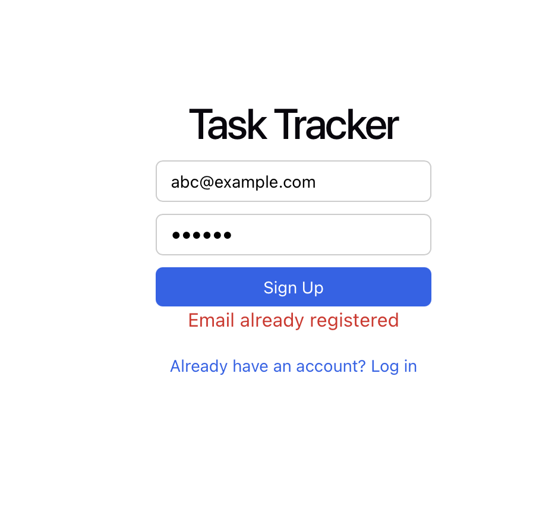
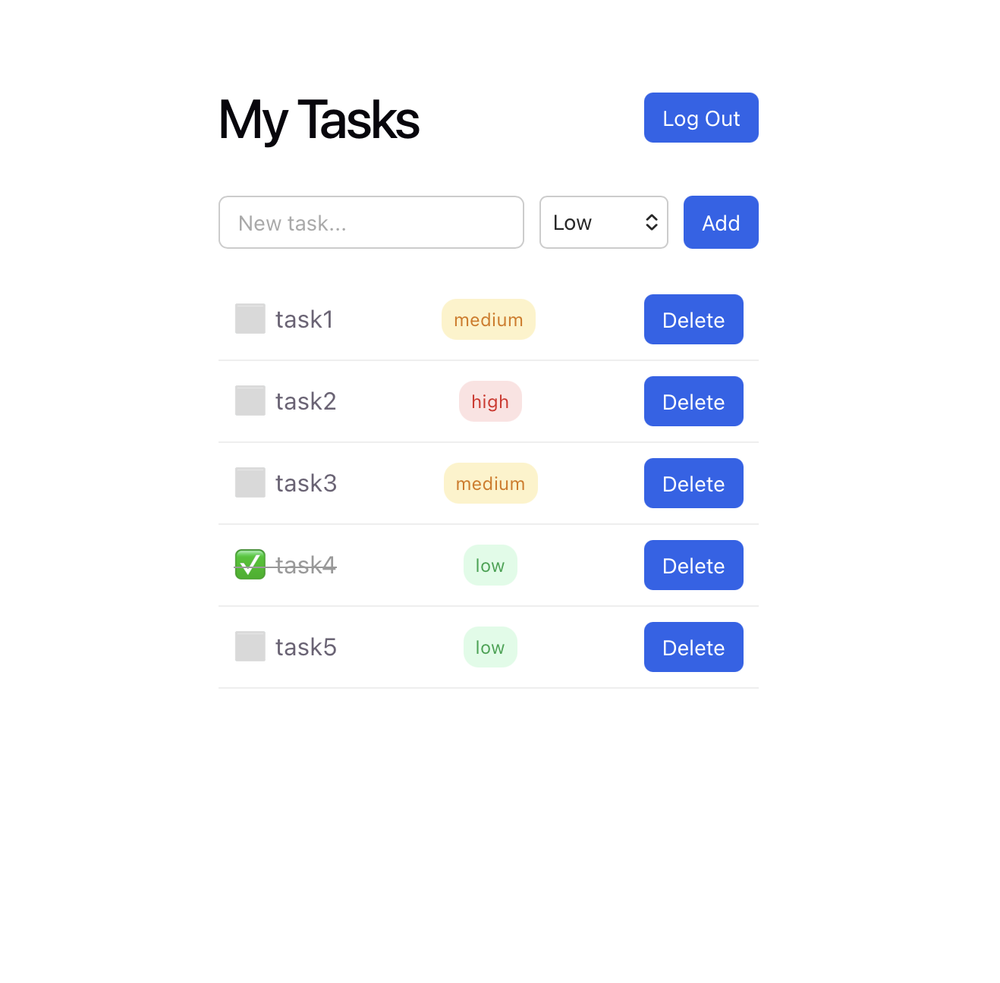
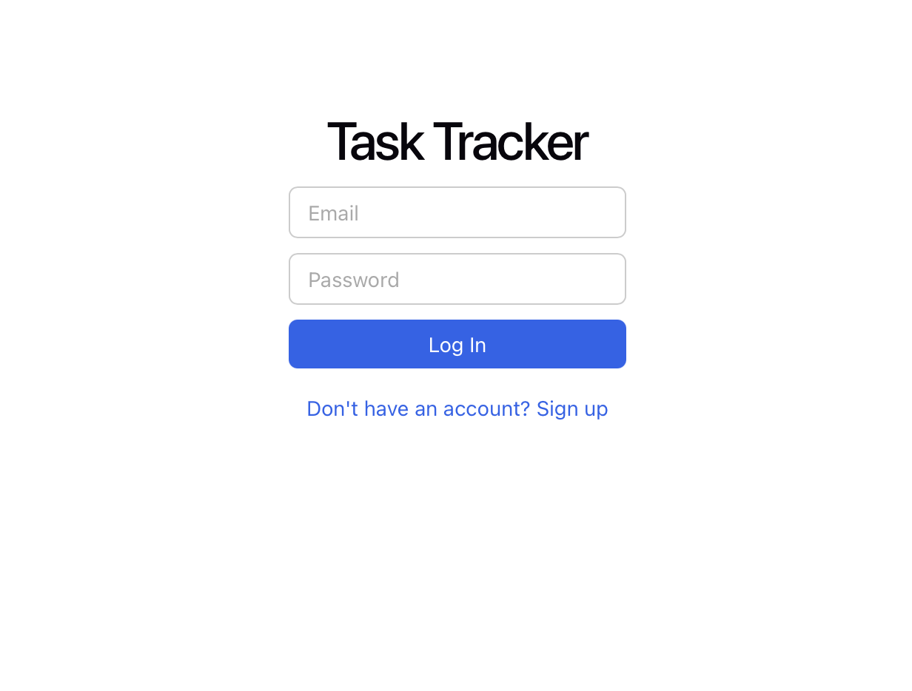

# Task Tracker API

A full-stack task management application with user authentication, built with FastAPI, SQLAlchemy, PostgreSQL, and a React frontend.

## 🚀 Live Demo

**App:** [https://yourtasktracker.duckdns.org](https://yourtasktracker.duckdns.org)
**API Docs:** [https://task-tracker-api-2p0j.onrender.com/docs](https://task-tracker-api-2p0j.onrender.com/docs)

> Note: the backend is on a free tier and may take 10-30 seconds to wake up on the first request after a period of inactivity.

## Screenshots

<p align="center">
  
  
</p>
<p align="center">
  
</p>

## Features

- User signup and login with JWT-based authentication
- Passwords securely hashed with bcrypt
- Each user has a private task list (enforced at the database level)
- Tasks support title, completion status, priority (low/medium/high), category, and due date
- Filter tasks by priority, category, or completion status
- Fully tested with pytest (11 automated tests)
- Dockerized backend
- CI/CD pipeline via GitHub Actions — runs tests and builds a Docker image on every push

## Tech Stack

**Backend:** FastAPI, SQLAlchemy, SQLite, JWT (python-jose), bcrypt (passlib)
**Frontend:** React (Vite)
**Testing:** pytest
**CI/CD:** GitHub Actions
**Containerization:** Docker

## Project Structure
task-tracker-api/
├── main.py # FastAPI app, routes
├── models.py # SQLAlchemy database models
├── database.py # Database connection setup
├── auth.py # Password hashing, JWT logic
├── test_main.py # Automated tests
├── requirements.txt # Python dependencies
├── Dockerfile # Backend container definition
├── .github/workflows/ci.yml # CI/CD pipeline
└── frontend/ # React frontend (Vite)
## Setup & Installation

### Prerequisites
- Python 3.12+
- Node.js and npm
- Docker (optional, for containerized run)

### Backend Setup

```bash
# Clone the repo
git clone git@github.com:ashishpagare22/task-tracker-api.git
cd task-tracker-api

# Create and activate a virtual environment
python3 -m venv venv
source venv/bin/activate

# Install dependencies
pip install -r requirements.txt

# Run the backend
uvicorn main:app --reload
```

Backend runs at `http://127.0.0.1:8000`
Interactive API docs at `http://127.0.0.1:8000/docs`

### Frontend Setup

```bash
cd frontend
npm install
npm run dev
```

Frontend runs at `http://localhost:5173`

### Running Both Together

Open two terminal tabs:

```bash
# Terminal 1 — Backend
cd task-tracker-api
source venv/bin/activate
uvicorn main:app --reload

# Terminal 2 — Frontend
cd task-tracker-api/frontend
npm run dev
```

Then open `http://localhost:5173` in your browser, sign up, and start adding tasks.

### Running with Docker (backend only)

```bash
docker build -t task-tracker-api .
docker run -d -p 8000:8000 --name task-tracker task-tracker-api
```

## Running Tests

```bash
source venv/bin/activate
python -m pytest -v
```

## API Endpoints

| Method | Endpoint | Description | Auth Required |
|--------|----------|--------------|----------------|
| POST | `/signup` | Create a new user | No |
| POST | `/login` | Log in, returns JWT token | No |
| POST | `/tasks` | Create a task | Yes |
| GET | `/tasks` | List your tasks (supports filters) | Yes |
| GET | `/tasks/{id}` | Get a specific task | Yes |
| PUT | `/tasks/{id}` | Update a task | Yes |
| DELETE | `/tasks/{id}` | Delete a task | Yes |

### Example: Filtering tasks
## Deployment

- **Frontend:** Vercel (custom domain via DuckDNS)
- **Backend:** Render
- **Database:** Supabase (PostgreSQL)
- **Config:** `SECRET_KEY` and `DATABASE_URL` are read from environment variables in production; local development falls back to SQLite and a dev-only secret key via a `.env` file (gitignored)

## Notes

This is a learning/portfolio project. A few things worth knowing:
- Free-tier hosting means the backend may spin down after inactivity, causing a slower first request
- No rate limiting or advanced security hardening beyond JWT auth and password hashing
